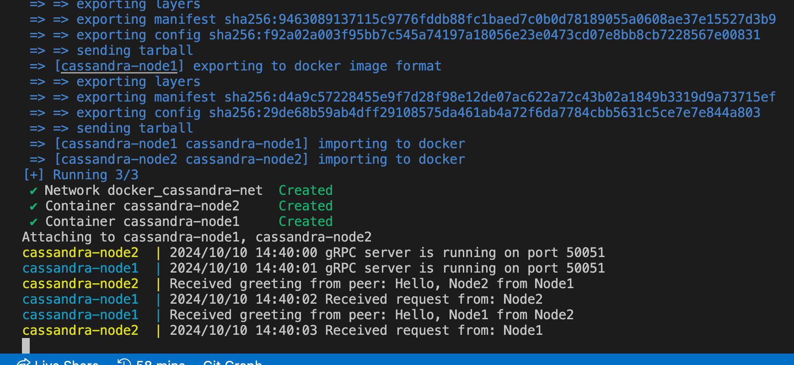

# TunaDB

^name for database to be decided :)

This project is a simplified version of a Cassandra-like distributed database written in Go. It is designed as a part of a Computer Science course called **Distributed Systems and Computing**. The project simulates core distributed database concepts such as consistent hashing, gossip protocol, quorum-based consensus, and more.

### Contribution Guidelines

See the Task ID in Notion. Use this task id when you create PR, so Notion could sync automatically.

## Project Structure

```
tuna-db/
│
├── docker/
│   ├── Dockerfile               # Custom Docker image setup (if needed)
│   └── docker-compose.yml       # Docker Compose file for running multiple nodes
│
├── proto/
│   └── cassandra.proto          # Protobuf definitions for gRPC communication between nodes
│
├── cmd/
│   ├── node/
│   │   └── main.go              # Entry point for running a Cassandra node server
│
├── internal/
│   ├── ring/                    # Consistent hashing implementation for distributing data
│   │   ├── ring.go              # Ring-based consistent hashing logic
│   │   └── ring_test.go         # Unit tests for consistent hashing
│   │
│   ├── db/                      # Database and storage logic
│   │   ├── memtable.go          # In-memory storage structure for fast read/write
│   │   ├── sstable.go           # SSTable file storage for persisting data
│   │   ├── db.go                # Core database operations combining memtable and SSTable
│   │   ├── writer.go            # Handles data writing and flushing to SSTable
│   │   ├── compaction.go        # SSTable compaction logic
│   │   └── db_test.go           # Unit tests for database operations
│   │
│   ├── replication/             # Manages replication and data synchronization
│   │   ├── replica_manager.go   # Replica management and partitioning logic
│   │   ├── quorum.go            # Implements quorum-based reads and writes
│   │   ├── sync.go              # Data sync for eventual consistency
│   │   └── replication_test.go  # Unit tests for replication logic
│   │
│   ├── gossip/                  # Implements gossip protocol for node communication
│   │   ├── gossip.go            # Node status and membership through gossip
│   │   ├── membership.go        # Membership management and state sharing
│   │   └── gossip_test.go       # Unit tests for gossip protocol
│   │
│   ├── failure/                 # Failure detection and handling
│   │   ├── detection.go         # Heartbeat-based failure detection
│   │   ├── handler.go           # Handling node failures and rebalancing data
│   │   └── failure_test.go      # Unit tests for failure detection and handling
│   │
│   └── utils/                   # Utility functions and configurations
│       ├── config.go            # Configuration management for nodes
│       ├── logging.go           # Logging setup for better observability
│       └── utils.go             # Common helper functions
│
├── api/                         # gRPC auto-generated files for server and client
│   ├── cassandra_grpc.pb.go     # Generated gRPC Go code (server)
│   └── cassandra_grpc.pb.gw.go  # Generated gRPC Gateway code (if REST support is needed)
│
├── scripts/                     # Scripts for setting up and testing the cluster
│   ├── run_cluster.sh           # Bash script to spin up a local cluster using Docker
│   └── test_data.sh             # Script for populating the cluster with test data
│
├── go.mod                       # Go module file
├── go.sum                       # Go dependencies file
├── README.md                    # Project documentation and setup instructions
└── .gitignore                   # Git ignore file for ignoring unnecessary files
```

## Getting Started

### Prerequisites

- Go (version 1.20 or later)
- Docker and Docker Compose
- `protoc` compiler for gRPC

This guide will walk you through setting up `protoc`, `protoc-gen-go`, and `protoc-gen-go-grpc` for gRPC development in Go on a Windows system.

- **Go Programming Language**: Ensure you have Go installed on your system. You can download it from [here](https://golang.org/dl/).

### 1. Install `protoc` (Protocol Buffers Compiler)

#### Step 1.1: Download `protoc`

- Go to the [Protocol Buffers GitHub Releases](https://grpc.io/docs/protoc-installation/). follow instructions for your OS.

#### Step 1.2: Extract the Files

- Extract the contents of the `.zip` file to a directory of your choice (e.g., `C:\protoc`).

#### Step 1.3: Add `protoc` to `PATH`

- Open the **Start Menu** and search for "Environment Variables".
- Select **Edit the system environment variables**.
- In the System Properties window, click **Environment Variables**.
- Under **System variables**, select the `Path` variable and click **Edit**.
- Click **New** and add the path to the `bin` directory inside the extracted `protoc` folder (e.g., `C:\protoc\bin`).
- Click **OK** to save and close all dialogs.

#### Step 1.4: Verify `protoc` Installation

Open a **Command Prompt** and run:

```bash
protoc --version
```

### 2. Install protoc-gen-go and protoc-gen-go-grpc

protoc-gen-go and protoc-gen-go-grpc are plugins that allow protoc to generate Go code for Protocol Buffers and gRPC.

#### Step 2.1: Install protoc-gen-go

Run the following command to install the protoc-gen-go plugin:

```bash
go install google.golang.org/protobuf/cmd/protoc-gen-go@latest
```

#### Step 2.2: Install protoc-gen-go-grpc

Run the following command to install the protoc-gen-go-grpc plugin:

```bash
go install google.golang.org/grpc/cmd/protoc-gen-go-grpc@latest
```

#### Step 2.3: Verify the Plugins are Installed

You need to ensure that both protoc-gen-go and protoc-gen-go-grpc are in your PATH. Run the following commands to verify:

```bash
where protoc-gen-go
where protoc-gen-go-grpc
```

Both commands should return paths similar to C:\Users\<your-username>\go\bin\protoc-gen-go.exe and protoc-gen-go-grpc.exe.

If not, ensure that your Go bin directory (usually C:\Users\<your-username>\go\bin) is added to your PATH environment variable.

### Setup Instructions

1.  **Clone the repository**:

    ```bash
    git clone https://github.com/uimagine-admin/tunadb.git
    cd tunadb
    ```

2.  **Generate gRPC code**:
    Generate the grpc code using protoc:
    Here you might want to install and set the env path variables!

        ```bash
        protoc --go_out=. --go-grpc_out=. proto/cassandra.proto
        ```

3.  **Build and Run the Docker containers**:
    Navigate to the docker directory and run the following command to start up the Cassandra nodes:

        ```
        docker-compose -f docker/docker-compose.yml up --build
        ```

### It should look like this!



### Folder Structure Overview

```
•	docker/: Contains Docker and Docker Compose configurations to set up a multi-node Cassandra cluster.
•	proto/: Holds the protobuf file (cassandra.proto) for defining the gRPC service used for communication between nodes.
•	cmd/: Contains entry points for running the server and client applications.
•	internal/: Core logic for the distributed database:
•	consistenthash/: Contains code for consistent hashing and the ring algorithm.
•	db/: Implements database storage, including in-memory tables (memtable) and persistent storage (SSTable).
•	replication/: Manages replica placement, quorum reads/writes, and eventual consistency.
•	gossip/: Manages the gossip protocol for node communication and status updates.
•	failure/: Implements failure detection mechanisms and node recovery.
•	utils/: Provides helper functions like logging and configuration management.
•	api/: Contains generated gRPC code to facilitate communication between client and server.
•	scripts/: Bash scripts to automate running the cluster and testing the system.
```

### License

This project is licensed under the MIT License. See the LICENSE file for more details.

### Acknowledgements

This project was inspired by the architecture of Apache Cassandra and aims to simulate the key distributed system concepts for educational purposes.
